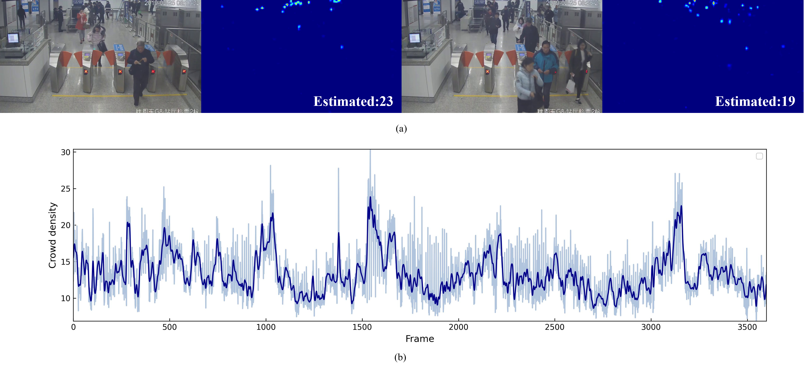

# Efficient Crowd Density Estimation with edge intelligence via structural reparameterization and knowledge transfer（ASOC）
Crowd stampedes and related incidents pose significant dangers to public safety and have resulted in numerous fatalities over the past few decades.
Estimating crowd density in real-time can help avoid stampedes by providing early warning systems to prevent overcrowding and manage the flow of people.
With the increasing prevalence of Internet of Things (IoT), the application of edge computing for field pedestrian density estimation can help to enhance security and efficiency of system.
To deal with the issue of crowd scale variation, most previous works rely on heavy backbone networks or complex module, which require high runtime consumption and severely limits the deployment scope of their work. 
To overcome this issue, we propose mutil-branch model Repmobilenet. for mutil-scale spatial feature extraction.
Repmobilenet equips with lightweight mutil-branch depthwise separable convolutional block (DSBlock), which can effectively extract multi-scale feature of dense crowd to cope with scale variation. 
In the inference phase, the mutil-branch structure can be transformed into a single-branch feed-forward structure through structural reparameterization. 
By this way, Repmobilenet can use multi-branch over-parameterized topology to capture more dense spatial features during training stage and decrease inference latency during inference stage.
We also added dilated convolutions in the backend to expand the receptive field of the model. 
Comparison to state-of-the-art mthods, proposed Repmobilenet is able to achieve comparable counting performance while maintaining samll model size and low inference latency in ShanghaiTech benchmark.
At last, we introduce a multi-layer knowledge distillation method to further increase the model's fitting capability.
By imitating the feature of multiple intermediate layers and final output soft ground truth of the teacher model, the student model can learn compact and efficient knowledge without increasing model size and inference latency.

# Bibtex
@article{lin2024efficient,  
          title={Efficient Crowd Density Estimation with edge intelligence via structural reparameterization and knowledge transfer},  
          author={Lin, Chenxi and Hu, Xiaojian},  
          journal={Applied Soft Computing},  
          pages={111366},  
          year={2024},  
          publisher={Elsevier}  
}

## Estimated results of crowd density on subway surveillance video.

